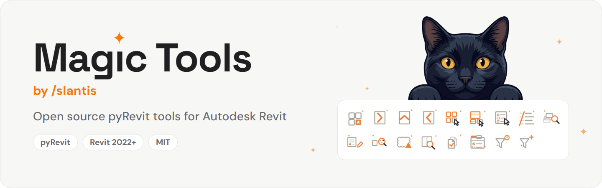
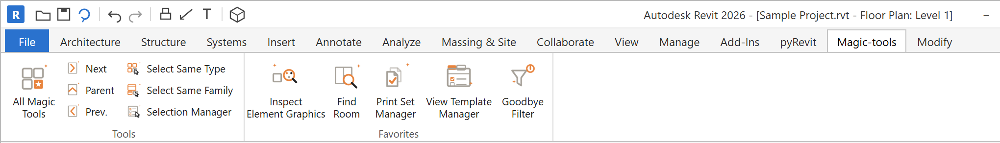

<p align="center">
  <picture>
    <source media="(prefers-color-scheme: dark)" srcset=".github/readme/header-dark.gif">
    
  </picture>
</p>

<p align="center">
  <a href="https://github.com/slantis/magic-tools/releases/latest"></a>
  <a href="LICENSE"></a>
  
  <a href="https://github.com/pyrevitlabs/pyRevit"></a>
</p>

Open source [pyRevit](https://github.com/pyrevitlabs/pyRevit) tools for Autodesk Revit,
made by [/slantis](https://github.com/slantis).

17 tools for view templates, filters, overrides, sheets, rooms and selection, plus
**All Magic Tools**, a searchable window for the eleven Favorites tools: star the ones you
want on the ribbon. Requires pyRevit and Revit 2022 or later.

**Quick install**, with pyRevit already installed:

```
pyrevit extend ui magic-tools https://github.com/slantis/magic-tools.git --branch=main
```

Then reload pyRevit. More options in [Install](#install).

## The ribbon


Magic Tools adds one tab to the Revit ribbon, **Magic-tools**, with two panels:
**Tools**, always on the ribbon, and **Favorites**, which shows only the tools you
starred.



```
Magic-tools tab
├── Tools          always on the ribbon
│   ├── All Magic Tools     searchable window for the Favorites tools; star the ones you want on the ribbon
│   ├── Navigation          Next Sheet · Parent Sheet · Previous Sheet
│   └── Selection           Select Same Type · Select Same Family · Selection Manager
└── Favorites      only the tools you starred
```

## Tools


### Tools panel

These are always on the ribbon. The Navigation and Selection tools below are not part of
All Magic Tools and cannot be starred.

| Group | Tool | What it does |
|---|---|---|
| | **All Magic Tools** | A searchable window for the eleven Favorites tools, grouped by what they are for, with a description of each one before you run it. Star a tool to put it on the ribbon's Favorites panel; unstar it to take it off. Revit keeps working while the window is open. |
| Navigation | **Next Sheet** | Goes to the next sheet in Project Browser order. Wraps around from the last sheet to the first. |
| Navigation | **Parent Sheet** | Goes to the sheet where the active view is placed as a viewport. |
| Navigation | **Previous Sheet** | Goes to the previous sheet in Project Browser order. Wraps around from the first sheet to the last. |
| Selection | **Select Same Type** | Grows the current selection to every element of the same type visible in the active view. Select one door and get every door of that type; select several elements of several types and get them all. With nothing selected, it asks you to pick elements first. |
| Selection | **Select Same Family** | Grows the current selection to every element of the same family visible in the active view, whatever its type. Select one window and get every window of that family on the view, in all its sizes. Works for loadable families and for system families (walls, floors, ducts). With nothing selected, it asks you to pick elements first. |
| Selection | **Selection Manager** | Breaks the current selection down by category, family and type, with a count and a checkbox on each row, under a foldable, tri-state category header. Uncheck a type to drop it and keep the rest of its category, keep only one row within its category with a double click, invert, or type to filter the rows. Apply rewrites the selection and the window stays open, so you can keep carving it while you work. Refresh re-reads the current selection. |

### Favorites panel

These eleven tools live in the Favorites panel, grouped as below. Star them in **All Magic
Tools** to show them on the ribbon.

| Group | Tool | What it does |
|---|---|---|
| Actions | **Rename Families** | Cleans up family and type names in bulk, in one window, with seven rules you can stack or use alone: remove or replace text, add a prefix or suffix, trim characters off either end, and change case (Title Case or UPPERCASE). A tree of your categories, families and types previews every resulting name live. Nothing is written until you confirm a review that lists every change and what will not be renamed and why. Name clashes are flagged and never written. Acronyms that stay uppercase in Title Case (ADA, MEP, RCP...) come from an editable list. |
| Analysis | **Inspect Model Overrides** | Finds the views that carry local element-level overrides or hidden elements, the stray ones a view template does not control. Pick the views by hand, narrow them to a print set, or keep only the views placed on sheets. A sortable grid shows the counts; double-click a row to open that view. |
| Analysis | **Inspect View Overrides** | Lists every element in the active view that has an element-level graphic override (Override Graphics in View > By Element) or is hidden in view (Hide in View > Element). From the grid you can select or show them, edit their overrides (color, weight, halftone, transparency, patterns), copy the overrides of another element, or clear overrides and unhide in one step. Category, filter and Visibility/Graphics overrides are not shown. |
| Analysis | **Inspect Element Graphics** | Select (or pick) one element and see everything that affects how it looks in the active view: element override, element hide, category override, category hide, the view filters it matches, and filter visibility off. Applies the precedence Revit uses and marks which source wins for each property (color, halftone, transparency, patterns): Element > Filter > Category > Default. |
| Annotate | **Clean Explode CAD** | Explodes an imported DWG into native detail lines on the line styles the project already has, editable text notes and real Revit leaders. Dimensions become notes and hatches are drawn from their DXF pattern. The CAD is deleted only if everything was converted, and the tool asks first. |
| Annotate | **Cloud Manager** | Manages revision clouds: pick the revisions, choose the views, then show, hide, tag, style, move or delete them and see what each action did. The window stays open while you work in Revit. |
| Navigation | **Find Room** | Searches rooms by name, number or level with live filtering. Selects the matching rooms in the model and zooms the active view to fit. Flags open (not enclosed) and redundant rooms with a status icon. Refresh re-reads the model without losing the search text. |
| Sheets | **Print Set Manager** | Shows which sheets and views belong to each print set and lets you edit them from one window: add or remove sheets, keep or drop any non-sheet view (floor plan, 3D view...) already in the set, create, rename or delete sets, and sort the sheet list by any sheet parameter, without opening the Print dialog. |
| Views, Templates & Filters | **View Template Manager** | Visibility/Graphics for many view templates at once, as a matrix: tick view templates on the left and they become columns; the rows are categories (Model and Annotation tabs) or filters (Filters tab). Each cell shows Visible / Hidden / N/A plus its overrides. Click a chip to stage a change on one cell, or open Selected rows for bulk actions on the ticked rows. Apply writes everything in one transaction. |
| Views, Templates & Filters | **Goodbye Filter** | Turns off every filter in the active view through Temporary View Properties mode, so nothing is permanently changed. Click again on the same view to restore. Views that cannot use the temporary mode (sheets, schedules) are left untouched, with a clear message. |
| Views, Templates & Filters | **Create Type Filter** | Creates a Parameter Filter from the Type Name of the selected elements and applies it with graphic overrides, all in one window: name, targets (the active view and every view template, with a note on where each one actually sends the filter) and the overrides editor side by side. Nothing is ticked by default: pick your targets, set the overrides, then create and apply. |

### How the stars work

Favorites starts with five tools starred: View Template Manager, Goodbye Filter, Rename
Families, Inspect Element Graphics and Print Set Manager. Open **All Magic Tools**, star or
unstar any of the eleven tools, and the Favorites panel follows. Your stars are saved per Windows user in
`%APPDATA%\pyRevit\_magictools_os_favorites.json`.

## Install


You need [pyRevit](https://github.com/pyrevitlabs/pyRevit/releases) installed, and Revit
2022 or later. A new install, with git or with the ZIP, puts Magic Tools in a folder called
`magic-tools.extension`.

### With git (recommended, receives updates)

Using the pyRevit CLI:

```
pyrevit extend ui magic-tools https://github.com/slantis/magic-tools.git --branch=main
```

Then reload pyRevit (or restart Revit). The **Magic-tools** tab appears in the ribbon. To
update later, use pyRevit's **Update** button. An install made with an earlier version
keeps its own folder name and updates in place.

### With a ZIP (no automatic updates)

1. Download `magic-tools.zip` from the latest
   [release](https://github.com/slantis/magic-tools/releases/latest).
2. Unzip it into a folder pyRevit loads custom extensions from, for example
   `%APPDATA%\pyRevit\Extensions`. The ZIP holds a single `magic-tools.extension` folder,
   so you end up with `...\Extensions\magic-tools.extension\`.
3. Reload pyRevit.

A ZIP install does not update itself: download a newer release to update.

### One copy only

pyRevit loads every extension folder it finds, so two copies of Magic Tools show every
tool twice. Keep only one, wherever pyRevit loads extensions from (the default Extensions
folder or any custom extensions path you added in pyRevit's settings). If you already have
another copy, for example `MagicTools.extension` from the first release, update it or
delete it before you install a new one.

## What we measure


From GitHub, the aggregate numbers it already reports for this repository: git clones,
page views, the sites that link here, the most viewed pages, release ZIP downloads, and
stars, forks and watchers. None of them identifies anyone. A scheduled GitHub Action saves
them once a day.

From the add-in, **only if you say yes**: the first time you click a Magic Tools button,
it asks whether you want to share usage data. If you do, it sends a random install ID, the
Magic Tools, Revit and pyRevit versions, how it was installed (git or ZIP), and the name,
result and time of each tool you run. Never your name, your computer's name, file or
model names, or paths. The install ID stays the same, so this data is pseudonymous, not
anonymous. Turn it off at any time with **Share usage data** at the bottom of All Magic
Tools, or for a whole office with the `DO_NOT_TRACK=1` or `MAGIC_TOOLS_TELEMETRY=0`
environment variable. [TELEMETRY.md](TELEMETRY.md) has every field, an example, and the
details.

## Found a bug?


[Open an issue](https://github.com/slantis/magic-tools/issues/new/choose) with the tool,
what happened, and your Magic Tools, Revit and pyRevit versions. The form asks for each
one. Security issues go through
[private reporting](https://github.com/slantis/magic-tools/security/advisories/new)
instead: see [SECURITY.md](.github/SECURITY.md).

## Contributing


Every change comes in through a pull request. These checks run on each one:

- **Compile:** Python 2.7 syntax and undefined names (pyRevit runs IronPython 2.7).
- **Policy:** no network access (except `lib/telemetry.py`, which sends the opt-in usage
  data to its one endpoint), processes, dynamic code, native library loading, registry
  access or hidden payloads, and only allowed file types.
- **Structure:** each tool has its `script.py`, four icons, a title and a tooltip, and is
  listed in its `bundle.yaml`; each Favorites tool is also listed in `lib/groups.json`.
- **Secrets:** a [gitleaks](https://github.com/gitleaks/gitleaks) scan.
- **Language:** everything in the repository is written in English.

The checks cannot open Revit. In your pull request, describe how you tested the change in
Revit.

## License

- Code: [MIT](LICENSE), Copyright (c) 2026 Slantis LLC.
- Icons, documentation and the "Magic Tools" name: [CC BY 4.0](LICENSE-CONTENT).
- DM Sans fonts in `lib/slantisui/fonts/`: [SIL Open Font License 1.1](lib/slantisui/fonts/OFL.txt).

<picture>
  <source media="(prefers-color-scheme: dark)" srcset=".github/readme/footer-dark.png">
  
</picture>
